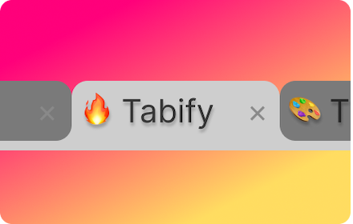

# Tabify 🎨
Customize Your Browser Experience. Change the icon and title of any tab.

## Description 👀:
Transform your browsing with Tabify, the ultimate Chrome extension for personalizing your tabs! With Tabify, you can effortlessly modify tab titles and icons to match your style or organizational needs. Express yourself uniquely by adding emojis and letters as icons. Whether you’re looking to streamline your workflow, add a touch of personality to your browser or simply looking for more privacy 😉, Tabify is the perfect tool 🔨 for you!

### TL: DR
Tabify lets you personalize tab titles and changing icons for emojis, and letters.

## Features
- ✅ Works on Chrome
- ✅ Persist after refreshing 🔄 or navigating to a new website 
- ✅ allow to add emojis or letters as Icons ❤️🔥
- ✅ can reset 🎚️
- ✅ random emoji and title by default

### Chrome
You can download the extension [here]().

## TODO:
maybe: save icon and name related to website.
add emty icon and custom icons.
color of tab?
icon picker to show the icons.
add emoji picker 
add default icon + title
