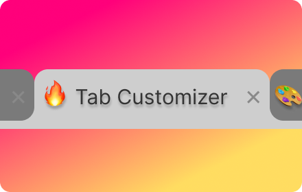

# Tab Customizer 🎨
Change the icon and title of any tab 🔥

download the extension [here](https://chromewebstore.google.com/detail/tabify/dodhmgkanlmnjcniefgkhffdopmhglif).

## Description 👀:
Whether you’re looking to streamline your workflow, add a touch of personality to your browser or simply looking for more privacy 😉, Tab Customizer is the perfect tool 🔨 for you!
Transform your browsing experience with this new Chrome extension for personalizing your tabs! With Tab Customizer, you can effortlessly modify tab titles and icons to match your style or organizational needs. Express yourself uniquely by adding emojis and letters as icons!

### TL: DR
It lets you personalize tab titles and changing icons for emojis, and letters.

## Features
- ✅ Works on Chrome
- 🔜 Works on Edge
- ✅ Persist after refreshing 🔄 or navigating to a new website 
- ✅ allow to add emojis or letters as Icons ❤️🔥
- ✅ fast access to native emojis
- ✅ can reset 🎚️
- ✅ random emoji and title by default

### Chrome
You can download the extension [here](https://chromewebstore.google.com/detail/tabify/dodhmgkanlmnjcniefgkhffdopmhglif).
### Edge
soon

## TODO:
- open native emoji picker
